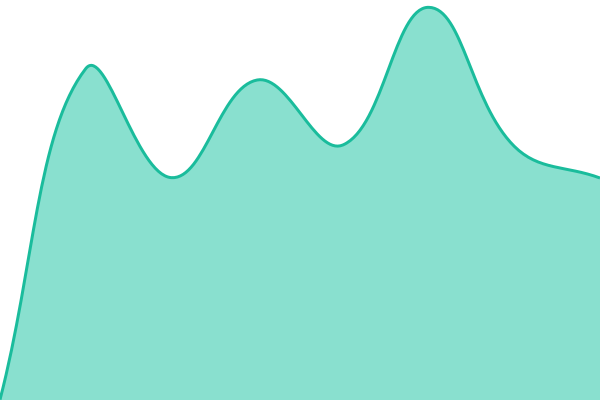

# [📈 Live Status](https://demo.upptime.js.org): <!--live status--> **🟩 All systems operational**

This repository contains the open-source uptime monitor and status page for [Human Does](https://demo.upptime.js.org), powered by [Upptime](https://github.com/upptime/upptime).

With [Upptime](https://upptime.js.org), you can get your own unlimited and free uptime monitor and status page, powered entirely by a GitHub repository. We use [Issues](https://github.com/human-does/mangobeds-status/issues) as incident reports, [Actions](https://github.com/human-does/mangobeds-status/actions) as uptime monitors, and [Pages](https://demo.upptime.js.org) for the status page.

<!--start: status pages-->
<!-- This summary is generated by Upptime (https://github.com/upptime/upptime) -->
<!-- Do not edit this manually, your changes will be overwritten -->
<!-- prettier-ignore -->
| URL | Status | History | Response Time | Uptime |
| --- | ------ | ------- | ------------- | ------ |
|  [Booking Form Health](https://www.mangobeds.com/api/health/booking-forms) | 🟩 Up | [booking-form-health.yml](https://github.com/human-does/mangobeds-status/commits/HEAD/history/booking-form-health.yml) | 

 725ms
     
 | 

<a href="https://status.mangobeds.com/history/booking-form-health">99.66%</a>
    

|  [Main Website Health](https://www.mangobeds.com/api/health/main) | 🟩 Up | [main-website-health.yml](https://github.com/human-does/mangobeds-status/commits/HEAD/history/main-website-health.yml) | 

 503ms
     
 | 

<a href="https://status.mangobeds.com/history/main-website-health">100.00%</a>
    

|  [API](https://api.mangobeds.com/health-check) | 🟩 Up | [api.yml](https://github.com/human-does/mangobeds-status/commits/HEAD/history/api.yml) | 

 1744ms
     
 | 

<a href="https://status.mangobeds.com/history/api">100.00%</a>
    

|  Server | 🟩 Up | [server.yml](https://github.com/human-does/mangobeds-status/commits/HEAD/history/server.yml) | 

 4087ms
     
 | 

<a href="https://status.mangobeds.com/history/server">100.00%</a>
    

|  Job Manager | 🟩 Up | [job-manager.yml](https://github.com/human-does/mangobeds-status/commits/HEAD/history/job-manager.yml) | 

 223ms
     
 | 

<a href="https://status.mangobeds.com/history/job-manager">100.00%</a>
    

|  Database | 🟩 Up | [database.yml](https://github.com/human-does/mangobeds-status/commits/HEAD/history/database.yml) | 

 126ms
     
 | 

<a href="https://status.mangobeds.com/history/database">99.50%</a>
    

|  [Database Full Chain](https://www.mangobeds.com/api/health/db) | 🟩 Up | [database-full-chain.yml](https://github.com/human-does/mangobeds-status/commits/HEAD/history/database-full-chain.yml) | 

 899ms
     
 | 

<a href="https://status.mangobeds.com/history/database-full-chain">100.00%</a>
    

<!--end: status pages-->

[**Visit our status website →**](https://demo.upptime.js.org)

## 📄 License

- Powered by: [Upptime](https://github.com/upptime/upptime)
- Code: [MIT](./LICENSE) © [Anand Chowdhary](https://anandchowdhary.com), supported by [Pabio](https://pabio.com)
- Data in the `./history` directory: [Open Database License](https://opendatacommons.org/licenses/odbl/1-0/)
